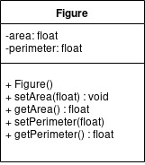

## Object-Oriented Programming (OOP)

A class is a blueprint for creating objects, providing:

* State (attributes)
* Implementation of behaviour (methods)

An object is an instance of a class

A set of objects, of the same class, will have the same methods, but their inner state will be different

--

Sample class



```
class Figure {
  constructor() {
    this._area = 0.0;
    this._perimeter = 0.0;
  }

  set area(area) {
    this._area = area;
  }

  set perimeter(perimeter) {
    this._perimeter = perimeter;
  }

  get area() {
    return this._area;
  }

  get perimeter() {
    return this.perimeter;
  }

  present() {
    return 'This is a Figure object';
  }
}
```